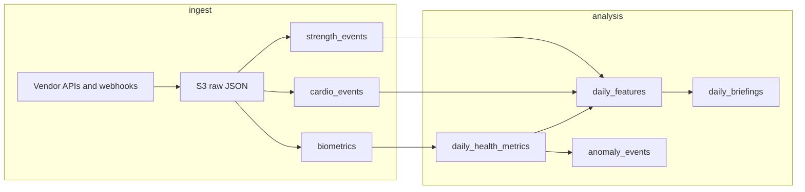

# Soma schema — diagram (planned)

High-level relationships. Every domain table references **`auth.users`** (Supabase Auth); the diagram uses `users` as shorthand for `auth.users`.

```mermaid
erDiagram
  users ||--|| user_settings : "1:1"
  users ||--o{ strength_events : has
  users ||--o{ cardio_events : has
  users ||--o{ biometrics : has
  users ||--o{ daily_health_metrics : has
  users ||--o{ daily_features : has
  users ||--o{ interventions : has
  users ||--o{ daily_briefings : has
  users ||--o{ anomaly_events : has

  user_settings {
    uuid user_id PK_FK
    text email
    text timezone
    time briefing_time
    timestamptz created_at
  }

  strength_events {
    uuid id PK
    uuid user_id FK
    text source
    text source_id
    date event_date
    text exercise_name
  }

  cardio_events {
    uuid id PK
    uuid user_id FK
    text source
    text source_id
    date event_date
    text activity_type
  }

  biometrics {
    uuid id PK
    uuid user_id FK
    text source
    date event_date
    text metric
    float value
  }

  daily_health_metrics {
    uuid id PK
    uuid user_id FK
    date metric_date
    float hrv_rmssd
    float sleep_hours
  }

  daily_features {
    uuid id PK
    uuid user_id FK
    date feature_date
    int strength_sessions_7d
    float cardio_minutes_7d
  }

  interventions {
    uuid id PK
    uuid user_id FK
    date event_date
    text category
    text description
  }

  daily_briefings {
    uuid id PK
    uuid user_id FK
    date briefing_date
    text coaching_note
  }

  anomaly_events {
    uuid id PK
    uuid user_id FK
    date detected_date
    text anomaly_type
    text description
  }
```

## Ingestion vs analysis path



For column-level detail, open [`schema/soma-planned-schema.sql`](../../schema/soma-planned-schema.sql).
